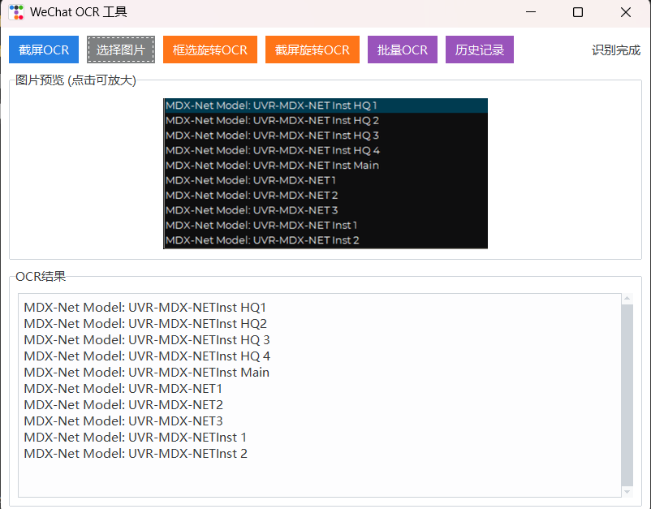
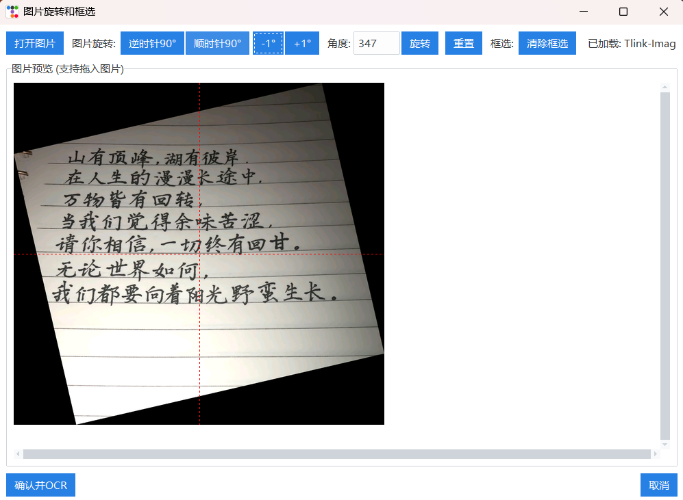
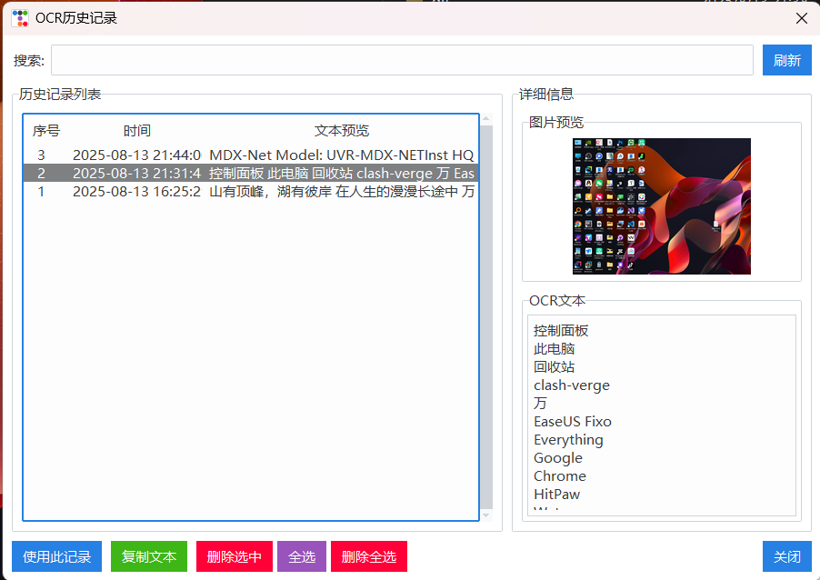

# WeChat OCR 文本识别工具

基于微信OCR引擎的桌面应用程序，能够高精度提取图片中的文字。该工具提供了直观的界面，支持多种OCR任务，包括屏幕截图、图片旋转和批量处理等便捷功能。

感谢：[wechat_ocr](https://github.com/kanadeblisst00/wechat_ocr?tab=readme-ov-file)

## 主要功能

- **截屏OCR**：捕获屏幕任意区域并立即提取文字
- **图片旋转与选择**：旋转图片并选择特定区域进行OCR识别
- **批量处理**：一次处理多张图片
- **历史记录管理**：记录所有OCR操作及时间戳
- **图片预览**：OCR前后查看和缩放图片
- **拖放支持**：直接将图片拖入应用程序
- **导出结果**：将OCR结果保存为TXT或CSV格式

## 系统要求

- Windows操作系统
- Python 3.7或更高版本（本人使用Python3.10）
- 微信OCR引擎文件（已包含在仓库中）
- 所需Python包：
  - tkinter
  - wechat-ocr
  - PIL (Pillow)
  - ttkbootstrap
  - tkinterdnd2（可选，用于拖放支持）

## 安装方法

1. 克隆仓库：
   ```
   git https://github.com/shiyaaini/wechat_ocr_ui
   cd weixin_ocr
   ```

2. 安装所需包：
   ```
   pip install -r requirements.txt
   ```

3. 确保微信OCR引擎文件位于正确的目录：
   - `WeChatOCR/`目录包含微信OCR可执行文件和支持文件
   - `[3.9.9.35]/`目录包含必需的DLL文件

## 使用说明

### 基本OCR操作

1. 运行应用程序：
   ```
   python ocr_app.py
   ```

2. 使用以下方法之一执行OCR：
   - 点击"截屏OCR"捕获屏幕一部分
   - 点击"选择图片"选择图片文件
   - 将图片拖放到应用程序窗口

3. 在结果区域查看提取的文本，在预览区域查看图片

### 高级功能

#### 图片旋转和选择

1. 点击"框选旋转OCR"打开图片并选择特定区域
2. 如有需要，调整旋转角度
3. 在要提取的文本周围绘制选择框
4. 点击"确认并OCR"处理选定区域

#### 批量处理

1. 点击"批量OCR"打开批量处理窗口
2. 添加包含图片的文件或文件夹
3. 点击"开始批量OCR"处理所有图片
4. 点击"导出结果"导出结果

#### 历史记录管理

1. 点击"历史记录"查看所有之前的OCR操作
2. 选择一个条目查看图片和提取的文本
3. 使用搜索功能查找特定内容
4. 根据需要复制、删除或导出历史记录条目

## 项目结构

- `ocr_app.py`：主应用程序文件
- `WeChatOCR/`：包含OCR引擎文件和模型
- `[3.9.9.35]/`：包含必需的DLL文件
- `files/`：存储处理后图片的目录（自动创建）
- `ocr_history.json`：存储OCR历史记录（自动创建）

## 注意事项

- 拖放功能需要tkinterdnd2包。如果未安装，此功能将被禁用，但应用程序仍然可以正常运行。
- 使用截屏OCR时，应用程序窗口将临时隐藏以捕获屏幕。
- 批量处理对类似类型的图片效果最佳。

## 运行结果







# 赞赏


## 致谢

本工具使用微信OCR引擎进行文本识别。OCR引擎的所有权利归其各自所有者所有。